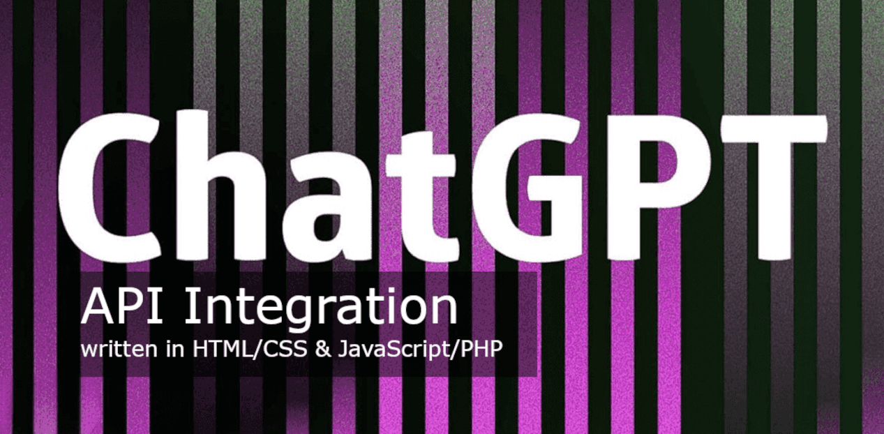
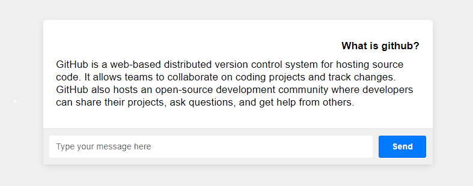

# Intégration de l'API ChatGPT (en HTML/CSS avec JS/PHP)
###### Mise à jour : 02.05.2023 (Fonctionne bien) Veuillez noter que cet exemple de code concerne une application Web de base.
##### À lire avant : [Meilleures pratiques de sécurité pour ChatGPT !](https://github.com/VolkanSah/ChatGPT-Security-Best-Practices)

#### Exemple d'intégration GPT-3, 3.5 et 4 pour vos sites Web utilisant HTML, CSS, JS et PHP.

- [Plug-in gratuit "Réponse aux commentaires ChatGPT" pour WordPress](https://github.com/VolkanSah/ChatGPT-Comments-Reply-WordPress-Plugin)
###### ChatGPT est intéressant, utilisons-le pour créer un monde meilleur.

Ce fichier README.md vous guidera tout au long du processus d'intégration de l'API ChatGPT dans votre site Web basé sur PHP, activant la fonctionnalité de chat à l'aide de l'API d'OpenAI.

## Conditions préalables
- PHP 7.4 ou supérieur installé sur votre serveur Web
- Un serveur Web prenant en charge PHP (par exemple, Apache ou Nginx)
- Connaissance de HTML, CSS et JavaScript (pour la conception de l'interface de chat)
- Une clé API pour l'API ChatGPT d'Openai.com

## Clé API
- Créez un compte ou connectez-vous à la plateforme OpenAi.
- Accédez à la section Clés API et générez une nouvelle clé API.
- Stockez la clé API en toute sécurité, car vous en aurez besoin à l'étape suivante.

## Configuration
- Cloner ou télécharger ce référentiel.
- Remplacez YOUR_API_KEY et MODEL dans config.php.
- Remplacez l'URL API_ENDPOINT dans gptchat.php selon vos besoins (voir liste ci-dessous).
- Téléchargez les fichiers index.html, style.css, script.js et gptchat.php sur votre serveur Web.
- Accédez à index.html dans votre navigateur (par exemple, https://votredomaine.com/index.html).
- Tapez un message dans le champ de saisie du chat et appuyez sur Entrée ou cliquez sur le bouton Envoyer pour envoyer le message.
- L'API OpenAI doit répondre par un message du modèle de langage.
- Soyez prudent et fixez des limites sur votre tableau de bord OpenAI.
## Points de terminaison OpenAi-API
**veuillez modifier gptchat.php & config.php selon vos besoins**

ENDPOINT | NOM DU MODÈLE
-- | --
/v1/chat/complétions | gpt-4, gpt-4-0314, gpt-4-32k, gpt-4-32k-0314, gpt-3.5-turbo, gpt-3.5-turbo-0301
/v1/complétions | text-davinci-003, text-davinci-002, text-curie-001, text-babbage-001, text-ada-001
/v1/edit | texte-davinci-edit-001, code-davinci-edit-001
/v1/audio/transcriptions | murmure-1
/v1/audio/traductions | murmure-1
/v1/fine-tunes | davinci, curie, babbage, ada
/v1/intégrations | text-embedding-ada-002, text-search-ada-doc-001
/v1/modérations | texte-modération-stable, texte-modération-dernier

Vous avez intégré avec succès l'API ChatGPT dans votre site Web PHP ! Désormais, vous pouvez personnaliser l'interface de chat et améliorer l'expérience utilisateur selon vos besoins.
## Capture d'écran

**Veuillez noter que cet exemple de code concerne une application Web de base et que vous devez envisager des mesures de sécurité supplémentaires. Veuillez lire [Meilleures pratiques de sécurité ChatGPT](https://github.com/VolkanSah/ChatGPT-Security-Best-Practices) ! **

## Merci
**"Merci ! Votre soutien est apprécié, et je vous serais reconnaissant si vous pouviez partager ce projet avec d'autres, lui attribuer une "étoile" sur GitHub ou devenir un sponsor. N'oubliez pas de me suivre pour plus d'idées gratuites et mises à jour !"**

## Licence
Ce projet est protégé par copyright © [IBAN-78](https://github.com/IBAN-78) et est sous licence MIT. Vous êtes libre d'utiliser, de modifier et de distribuer le code et les actifs, tant que l'avis de droit d'auteur et l'avis d'autorisation sont conservés dans toutes les copies ou parties substantielles du logiciel."

## Crédits
Droits d'auteur : IBAN-78
